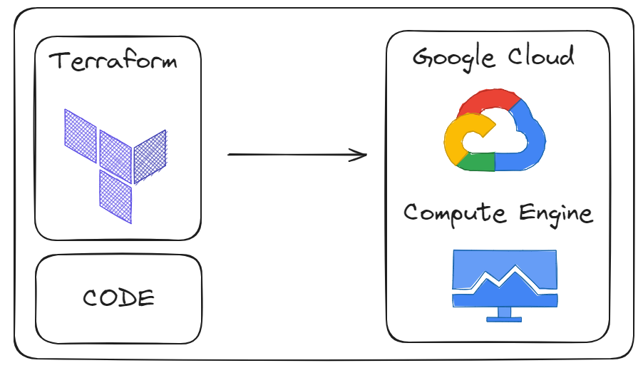

# Terraform

## About

O projeto consiste em criar uma máquina virtual (compute engine) na GCP (Google Cloud Platform) através do Terraform.

Configurações utilizadas na criação da VM:

- Ubuntu
- Disco com 40gb
- IP estático

## Prerequisites

Instalar o Terraform

Vídeo tutorial da instalação: https://www.youtube.com/watch?v=bSrV1Dr8py8

## Commands
### Inicializar o Terraform

    terraform init

### Verificar o plano
    
    terraform validate

### Aplicar configurações 
        
    terraform apply

### Destruir recursos
    
    terraform destroy

## References
https://developer.hashicorp.com/terraform/tutorials/gcp-get-started/google-cloud-platform-build

## Developer

[Wallace Camargo](https://www.linkedin.com/in/wallace-camargo-35b615171/) 
